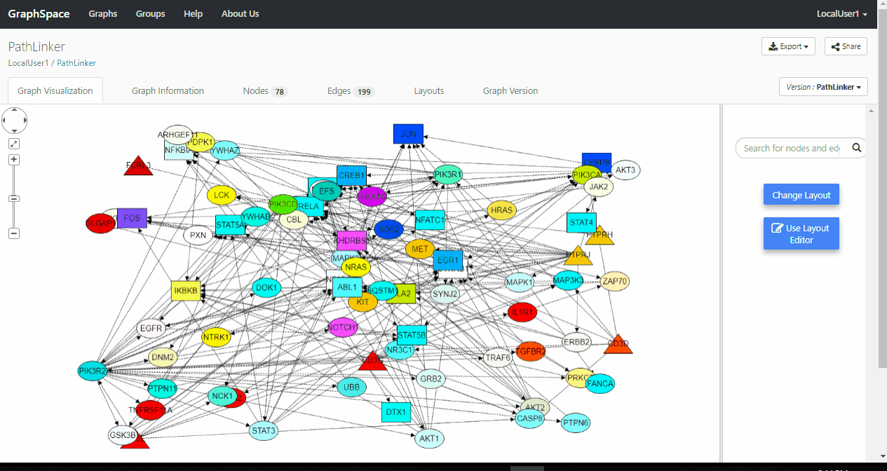
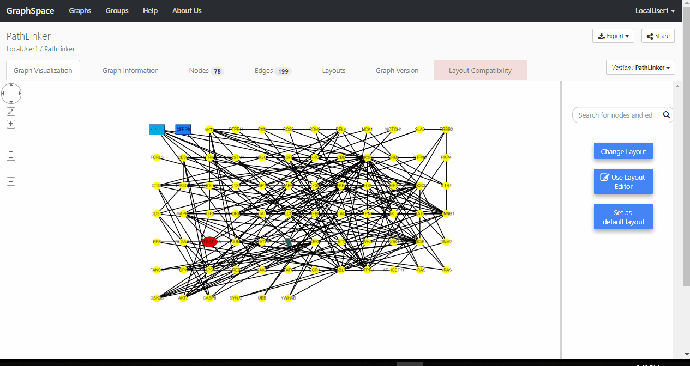

# Layout Compatibility

GraphSpace allows it's Users to create User Defined Layouts for graphs. There could be possible scenarios where a Layout for a particular version of a graph may or may not be compatible with some other version of the graph.
The Layout Compatibility feature gives Users the ability to check whether a layout is compatible with a version of Graph in GraphSpace. The User needs to be signed-in to [GraphSpace](http://www.graphspace.org) in order to use this feature.

The following features are available in the Layout Compatibility functionality:

- [Checking Layout Compatibility](#checking_layout-compatibility)
- [Layout Compatibility Tab](#layout-compatibility-tab)

## Checking Layout Compatibility

Anytime a User tries to apply a Layout on a particular version of the Graph, GraphSpace checks the layout compatibility status and does one of the following operations :
1. If the compatibility status is `True`, then it the Layout is applied on the current version of the Graph.
2. If the compatibility statis is `False`, then the user is notified that the selected layout is incompatible and cannot be applied for the current version of the Graph.
3. If compatibility is `undefined` or `unknown`, then a check is performed to determine whether the layout is compatible with the current version of the graph or not.

### Incompatible Nodes and Edges

GraphSpace Users will be notified about the Nodes & Edges which are incompatible for the current selection of Layout and Graph Version.

## Layout Compatibility Tab

The `Layout Compatibility` tab displays a list of incompatible nodes & edges for the current layout and graph version. The tab is visible only when there are compatibility issues for the selected layout with the current version of the graph. The incompatible elements are displayed in a table format. The table contains following columns:

1. **Element Name** - Name of the incompatible Node or Edge.
2. **Selector** - The selector for this particular element.

The table allows sorting based on Element Name. In order to sort by element type (node or edge) the user can click on Selector header in the table.
The image below shows an example of Layout Compatibility Tab when a user clicks on the `Layout Compatibility` tab link:

### Edit Nodes & Edges

Users of GraphSpace can edit the layout of incompatible nodes and edges by clicking on the `selector` in the Layout Compatibility table.

