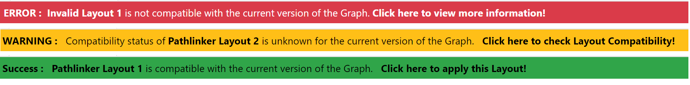

# Layout Compatibility

GraphSpace allows it's Users to create User Defined Layouts for graphs. There could be possible scenarios where a Layout for a particular version of a graph may or may not be compatible with some other version of the graph.
The Layout Compatibility feature gives Users the ability to check whether a layout is compatible with a version of Graph in GraphSpace. The User needs to be signed-in to [GraphSpace](http://www.graphspace.org) in order to use this feature.

The following features are available in the Layout Compatibility functionality:

- [Layout Selection Dropdown Menu](#layout-selection-dropdown-menu)
- [Layout Compatibility Status Bar](#layout-compatibility-status-bar)
- [Checking Layout Compatibility](#checking-layout-compatibility)
- [Fixing Layout Compatibility Errors](#fixing-layout-compatibility_errors)

## Layout Selection Dropdown Menu

The Layout Dropdown menu allows Users of GraphSpace to quickly select and apply the Layouts.
There are 3 the broad sections to the Dropdown Menu -
1. Automatic Layouts - System defined layouts available to all the Graphs in GraphSpace
2. Private Layout - Layouts created by User for the Current Graph.
3. Shared Layouts - Layouts shared by Users of GraphSpace

## Layout Compatibility Status Bar

The ticker bar used for notifying the User are of 3 different Colors corresponding to 3 different situations -
1. Red - For Errors, like incompatible Layout or layout missing nodes/edges of Graph.
2. Yellow - For Warnings, If the compatibility status of the Layout is unknown or if the layout has additional nodes/edges which are not present/required in the current version of the Graph.
3. Green - For unknown layouts, after the Layout compatibility check if the layout is found to compatible then the User is notified in a Green Ticker bar.

## Checking Layout Compatibility

Anytime a User tries to apply a Layout on a particular version of the Graph, GraphSpace checks the layout compatibility status. Based on the layout compatibility status, 3 scenarios may arise -

- [The layout is compatible with the current version of the Graph](#layout-is-compatible)
- [Layout is not compatible with the current version of the Graph, &](#layout-is-not-compatible)
- [The compatibility status of the layout is not known](#layout-compatibility-is-unknown)

### Layout is compatible

If the layout is compatible with the current version of the Graph then it simply applied to the Graph. The User will not receive any Error or Warning Notification in the Status Bar.

### Layout is not compatible

If the layout is not compatible with the current version of the Graph then the User is notified about this issue in the Layout Compatibility Status Bar. The status bar turns red to notify the User that there are `Errors` in the Layouts. The User needs to fix the errors before they can apply the layout.

### Layout Compatibility is unknown

If the compatibility of the Layout with the current version of the Graph could not be determined then the User is notified about this issue in the Layout Compatibility Status Bar. The status bar turns Yellow to warn the User about the unknown layout compatibility status. The User can run a compatibility check to determine whether the layout is compatible or not.

The layout compatibility check will return either of these 2 results -
1. Layout is compatible - The user is notified using a `Green` status bar suggesting that the Layout is compatible and can be applied. The status is then stored in the database to allow Users to skip the Layout Compatibility checking step next time they want to use this layout.

2. Layout is not compatible - The conflicting or missing nodes & edges are displayed in a List format. The User can then edit these nodes & edges to fix the errors.

## Fixing Layout Compatibility Errors

Users can add style information for nodes & edges by clicking on the **Add Style** in `Nodes/Edges without Style information` Table.
The status bar displays the number the elements which require attention of the User. This status bar is updated in real-time as the User adds Style for the missing elements.

When the User has successfully added style for all the missing elements then the Status bar will be updated based on the following 2 conditions -
1. Both the `Nodes/Edges without Style information` & `Unknown Nodes & Edges` Tables are empty - In this case the Status bar will disappear from the screen suggesting that all issues have been resolved.
2. `Unknown Nodes & Edges` Table is not empty - In this case the Status bar changes to `Warning` to let the User know that there are additional elements in the Layouts which are not present in the Graph.

