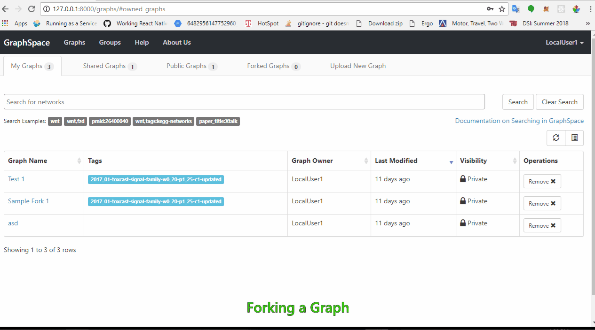
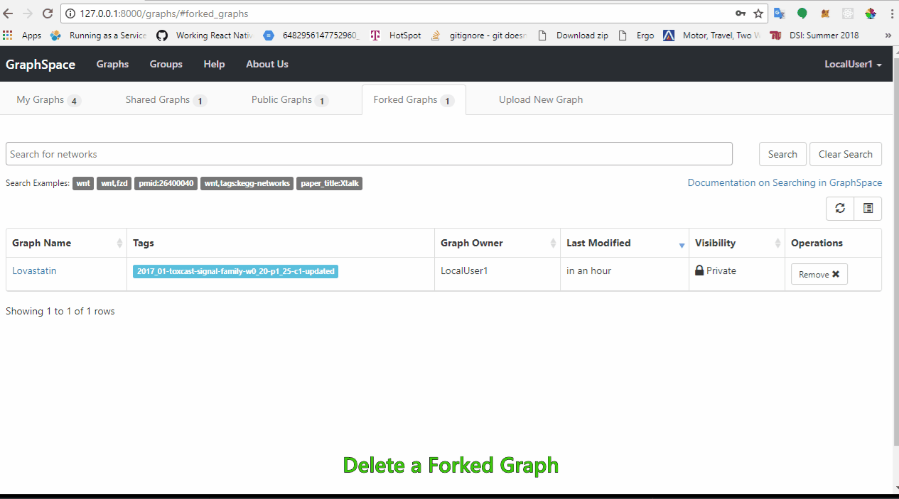

# Forking Graphs

The Fork feature gives Users the ability to create a copy of other Graphs in GraphSpace. The User needs to be signed-in to GraphSpace in order to use this feature. [GraphSpace](http://www.graphspace.org) allows users to fork the following types of Graphs:

1. **Public Graphs** - Users can fork any and all public graphs.
2. **Shared Graphs** - Users can fork any graph which has been shared with them in some Group.

The following features are available in the Fork graph functionality:

- [Forked Graphs Tab](#forked-graph-tab)
- [Create a Fork](#create-a-fork)
- [Delete a Forked Graph](#delete-a-forked-graph)

## Forked Graphs Tab

The `Forked Graphs` tab displays information about the forked graphs in a table format. The table contains following columns:

1. **Graph Name** - Name of the forked graph.
2. **Tags** - Tags associated with the forked graph.
3. **Graph Owner** - Email address of the owner of the graph.
4. **Last Modified** - The time when the graph was last modified.
5. **Visibility** - Private or Public.
6. **Operations** - Allows users to remove a forked graph.

The image below shows an example of Forked Graphs Tab when a user clicks on the `Forked Graphs` tab link:

## Create a Fork

GraphSpace allows Signed-in Users to Fork all Public graphs and graph(s) shared with them in some group(s).
A graph can be forked using the following steps :

1. Clicking on the `Fork` button opens a confirmation pop-up.
2. User has the option to edit the name of forked graph or use the default name.
3. User is notified when the Graph has been forked successfully. In case of any error during forking, the user is notified with an error message.

## Delete a Forked Graph

The User can delete a forked graph by clicking on the remove button next to forked graphs in the Forked Graph Tab.

The following example shows a user deleting a forked graph.

